# Kairos architecture

## Shape

- **A pure core.** `model`, `scoring`, `search`, `ballot`, and `provenance` do
  no network or file I/O. Their value types are frozen dataclasses, so they
  hash and dedupe safely. One exception: `search.prepare_groups` prints a
  warning and can raise `SystemExit` on bad config.
- **I/O at the edges.** `api` (network + 24h disk cache), `cli` (argparse,
  stdout), `tui/` (Textual).
- **Scoring runs in two passes.** An expensive weight-independent pass
  (`search.score_raw`) feeds a cheap re-weighting pass
  (`search.weight_scored`). The TUI's live sliders depend on this split.
- **Every sort breaks ties explicitly**, almost always on `class_no`. Output
  stays stable run to run, and the property tests assume it.

## Data flow

```mermaid
flowchart LR
    URL[NUSMods share URL] --> CLI[cli.py / tui.startup]
    CLI --> API[api.py<br/>fetch + 24h cache]
    API --> MODEL[model.py<br/>Session / Choice / ChoiceGroup]
    MODEL --> PREP[search.prepare_groups<br/>apply fixed + locked + accept]
    PREP --> ENUM[search.enumerate_clashfree<br/>footprint-deduped backtracking]
    ENUM --> RAW[search.score_raw<br/>weight-independent, cached]
    RAW --> W[search.weight_scored<br/>cheap re-weight]
    W --> RANK[rank / rank_arrangements]
    W --> PROV[provenance.py<br/>uncapped stats]
    RANK --> BALLOT[ballot.py<br/>cluster → fill to 20 → snake]
    PROV --> BALLOT
    BALLOT --> OUT[output.py / tui]
```

Stage by stage:

1. **Resolve.** `cli` or `tui.startup` turns a share URL or an on-disk
   `config.yaml` into `ChoiceGroup`s, fetching each module through
   `api.fetch_module`.
2. **Narrow.** `search.prepare_groups` applies `fixed` (pins a class number),
   `locked` (pins a slot signature), and `accept` (restricts a group to a set
   of slot signatures), in that precedence order.
3. **Enumerate.** `search.enumerate_clashfree` backtracks over the narrowed
   groups and yields every clash-free combination.
4. **Score.** `search.score_raw` computes six raw criteria per combo once;
   `search.weight_scored` applies the current weights.
5. **Rank.** `search.rank` picks the top timetables.
   `search.rank_arrangements` collapses combos that differ only by an
   interchangeable week-variant into `Arrangement`s with per-slot bids.
6. **Measure.** `provenance.arrangement_provenance` computes ceiling, median,
   and support over *every* arrangement, never a capped subset.
7. **Ballot.** `ballot` clusters interchangeable options, fills out to the
   20-slot NUS cap, and emits them in mirror/snake order.
8. **Render.** `output` writes text and Rich for `kairos run`; `tui/render`
   and `tui/widgets` draw the same data live.

Only `run` and `tui` reach stage 2. `kairos init` stops after stage 1: it
prompts for difficulties and priority, then writes `config.yaml`.

## Module map

Dependencies run one way. `model` imports nothing else in the package;
`scoring` imports `model`; `search` imports both; `ballot`, `provenance`, and
`output` sit above them; `cli` and `tui/` sit on top.

### `model.py`

The domain's leaf module.

- `DAYS` (Monday–Saturday), `LESSON_ABBREV` / `LESSON_FULL` (NUSMods lesson
  names ↔ abbreviations), and the time helpers `parse_time`, `parse_clock`,
  `fmt_time`, `fmt_clock`, `week_label`.
- `Session` (frozen: `day, start, end, weeks, venue`). `online` means the
  venue starts with `E-Learn`. `clashes(other)` requires the same day,
  overlapping `[start, end)`, **and** intersecting weeks — alternating-week
  sessions never clash.
- `Choice` (frozen: `module, lesson_type, class_no, sessions`) exposes
  `slot_sig` and `footprint` (see [Vocabulary](#vocabulary)) plus its own
  `clashes(other)`, true when any session pair clashes.
- `ChoiceGroup` (mutable: `module, lesson_type, choices`) with a `key`
  property.

### `api.py`

The only network boundary, and the sole user of `requests`.

- `normalise_weeks(weeks)` turns a NUSMods week list into a `frozenset`, or
  assumes all 13 teaching weeks for date-ranged (irregular) modules.
- `fetch_module(acad_year, code, cache_dir, ttl_hours=24.0)` serves a cache
  file younger than `ttl_hours`, else GETs NUSMods. On a
  `requests.RequestException` it falls back to a stale cache with a warning,
  or raises `SystemExit` when no cache exists.
- `semester_timetable(module_json, semester)` raises `SystemExit` if the
  module isn't offered that semester.
- `build_groups(code, timetable)` groups raw lessons by type then class
  number, sorted by both.

### `config.py`

The YAML schema and its defaults.

- `DEFAULT_BALLOTED = ["TUT", "LAB", "REC", "SEC"]` and
  `DEFAULT_PREFERENCES` (the six criteria's default weights).
- `Preferences` holds clock-int `earliest_start`, `latest_end`,
  `lunch_start`, `lunch_end`, plus `max_difficulty_per_day`, `lunch_minutes`,
  and `weights`.
- `Config` holds `acad_year, semester, balloted_types, modules, fixed,
  priority, preferences, alternatives_per_module, top_n,
  max_arrangements=50, locked, accept, migrated_from_fixed`. That last field
  exists only to sharpen an error message after a TUI-side `fixed`→`locked`
  migration; it never reaches disk.
- `Config.difficulty(module, lesson_type_full)` defaults to 3.
- `config_from_dict(data, source="config")` validates and builds a `Config`,
  raising `SystemExit` for missing keys, out-of-range difficulties, or a
  `priority` entry naming an unknown module. `load_config(path)` reads the
  file and delegates to it.

### `search.py`

The enumeration and ranking engine, and the largest module.

- `prepare_groups(groups, config)` narrows each group via a four-tier
  precedence cascade: `fixed` > `locked` > `accept` > all. It checks `fixed`
  first and finalizes with `continue`, so `fixed` wins when a group has both.
  It then checks `locked`, keeping every choice sharing the named class's
  `slot_sig`. If neither, it checks `accept`, keeping choices whose `slot_sig`
  matches one of the listed class numbers (each number designates a timeslot,
  so venue/week twins at that slot stay available). Otherwise it warns when a
  non-balloted group still offers several choices. Because narrowing happens
  at space construction, every downstream consumer inherits the restriction —
  `ballot.py` needs no knowledge of the feature.
- `find_irreconcilable(groups)` returns the first group pair whose every
  choice clashes with the other's — the source of the "every X clashes with
  every Y" message.
- `enumerate_clashfree(groups)` returns an `EnumeratedSpace` (frozen:
  `combos, members`). It first reduces each group to one representative per
  footprint, sorts groups by branching factor, then backtracks. `members`
  keeps every original choice keyed by footprint so venue and class siblings
  can be recovered later.
- `score_raw(space, config)` is the expensive pass. It caches one
  `scoring._fragment` per distinct `Choice` and combines fragments per combo,
  returning `[(raw_dict, assignment, combo), ...]` — what `AppState._raw_cache`
  holds. `weight_scored(raw_entries, config)` reapplies `scoring.weight_raw`
  to that list. `score_combos` composes the two for one-shot callers.
- `rank(space, config, scored=None) -> SearchResult` heap-selects the top
  `config.top_n` combos and records each `(module, lesson_type, footprint)`'s
  best score into `best_by_footprint`, which `ballot.all_options` needs.
- `build_arrangement_structure(space)` groups combos by `_arrangement_key`.
  For each group it checks whether the per-slot footprint options form a full
  Cartesian product (product of option counts equals group size). If they do,
  the group collapses into one `_ArrTemplate` carrying per-slot week-twin
  bids and a `variant_count`. If they don't, the group is *entangled* and
  each combo becomes its own single-member template — collapsing it would
  advertise a slot combination that never actually coexists.
- `candidates_from_structure(structure, scored)` picks each template's
  best-scoring member, tiebreaking on sorted `class_no` tuples.
- `rank_arrangements(space, config, limit=None, scored=None, structure=None)`
  selects the top `limit` candidates and builds `Arrangement`s (`score,
  breakdown, assignment, bids, variant_count`), expanding each `SlotBid`
  (`module, lesson_type, options`) to every sibling class number sharing a
  footprint.
- The module-level `search(groups, config)` wrapper has no caller in the
  package — `cli` and the TUI call the stages separately — but the tests
  enter through it.

### `scoring.py`

The pure arithmetic behind every criterion.

- `COMPONENT_LEGEND` holds each criterion's human-readable description, which
  `output.py` reuses verbatim. `_merged_intervals(sessions)` merges
  overlapping `(start, end)` pairs.
- `_Fragment` (a `NamedTuple`) is everything derivable from one `Choice`
  under a fixed config: `module, is_lecture, time_window, campus_by_day,
  pairing_days, naive_by_day, tough_by_day`. `_fragment(c, config)` builds it
  once per distinct choice. `time_window` and `campus_by_day` skip online
  sessions; `tough_by_day` counts them.
- `tough_day_peaks(choices, config)` finds `{day: peak weekly difficulty}`
  for days exceeding the cap. The peak is the largest single teaching week's
  summed difficulty, so alternating-week classes on one day never
  double-count. A fast path skips days whose naive sum already fits.
  `output.class_warnings` calls it.
- `pairing_impossibility(members)` finds modules whose campus lecture can
  never share a day with any non-lecture slot (`unpairable_modules`, scored
  as satisfied rather than penalised) and the exact
  `(module, lesson_type)` slots responsible (`unpairable_slots`, which
  suppress that slot's warning in `output`).
- `_combine(fragments, config, unpairable_modules)` is the single place all
  six raw criteria come from: `time_window, tough_days, same_day_pairing,
  free_days, gaps, lunch`. It negates and divides `time_window`'s integer
  minutes once on the summed total, never per fragment, so the float stays
  bit-identical to a one-shot computation.
- `compute_raw`, `weight_raw`, and `score_assignment` serve callers outside
  the two-pass hot path. `weight_raw` turns a raw dict into
  `(total, breakdown)` using `config.preferences.weights`.

### `ballot.py`

Turns a `SearchResult` — plus an optional `Provenance` — into the 20-slot
ballot.

- `BALLOT_TYPE_ORDER` sets column order within a module. `BALLOT_CAP = 20` is
  the single source for NUS's per-round ranked-slot maximum. `BallotOption`
  carries `module, lesson_type, class_no, letter, best_score, sessions,
  tied_with`.
- `all_options(result, config, provenance=None)` lists options per group,
  uncapped. It builds `viable` from every footprint in
  `result.best_by_footprint` — one that survived into some clash-free
  timetable — with one representative `Choice` and one clash-set each. Two
  footprints cluster together only when they share both a `slot_sig` and an
  identical clash-set. Clusters sort by `(-ceiling, -median, -support,
  class_no)` given a `Provenance`, else `(-best_score, class_no)`. A
  round-robin then hands out one class per cluster per round, so a second
  copy of an already-offered timeslot never outranks fresh coverage.
- `ranked_options(...)` truncates that to `config.alternatives_per_module`
  per group for the CLI's backup-choices section; `<= 0` returns `{}`.
- `fill_to_cap(full, config, cap=BALLOT_CAP)` starts from the same baseline,
  then repeatedly gives the next slot to whichever group's best unused option
  scores highest, tiebreaking on `(module, lesson_type, class_no)`.
- `snake(options_by_group, config, cap=BALLOT_CAP)` orders groups into
  columns by `(config.priority index, BALLOT_TYPE_ORDER index)`, emits round
  1 left to right, round 2 reversed, and so on, truncated to `cap`.
- `shortfall(entries, cap=BALLOT_CAP)` is `max(0, cap - len(entries))`.
  Non-zero means too few viable options exist across every balloted group.

### `provenance.py`

Cross-arrangement statistics, always uncapped.

- `Provenance` (frozen: `total, scores, distinct, by_arrangement, by_class`).
  `scores` lists every collapsed arrangement's score descending; `distinct`
  deduplicates it within `1e-9`. An arrangement's 1-based **tier** is its
  index into `distinct`, plus one. `by_arrangement` maps an index to the
  frozenset of `(module, lesson_type, class_no)` it contains; `by_class`
  reverses that.
- `tier_of(score)` returns the tier of the best distinct score
  `<= score + TOLERANCE`, so an interpolated value — a median can land
  between two real scores — never claims a tier no arrangement reached.
- `cluster_stats(keys)` unions `by_class` over a whole interchangeable
  cluster and returns `ClusterStats` (frozen: `ceiling, median, support,
  ceiling_tier, median_tier`), or `None` when the cluster never appears in a
  clash-free timetable.
- `arrangement_provenance(space, config, scored=None, structure=None)` builds
  from `candidates_from_structure` rather than `rank_arrangements`, skipping
  bid construction and venue expansion it doesn't need. It sorts candidates
  by `-score` to match `rank_arrangements` exactly, because the TUI indexes
  `by_arrangement` against a selection made from `rank_arrangements`.

### `output.py`

Presentation only, shared by `cli`'s prints and the TUI's `Static` widgets.
It renders already-scored, already-assigned data and never touches
`EnumeratedSpace` or ranking. It imports no Rich at all: every Rich
renderable is built in `tui/render.py`.

- `WEEKDAYS`, `GRID_HOURS = range(8, 21)`, and `CELL = 8` lay out the week
  grid. `_render_days(assignment, extra_days=None)` always covers
  Monday–Friday and adds Saturday only when a session lands there, or when
  the TUI's live-preview highlight names it.
- `share_url(assignment, semester)` rebuilds the NUSMods share link.
  `render_week(assignment)` draws the plain-text grid and agenda.
  `render_breakdown(total, breakdown)` prints raw, weighted, and description
  per criterion, pulling descriptions from `scoring.COMPONENT_LEGEND`.
- `class_warnings(assignment, config, space=None, unpairable_slots=None)`
  re-derives the same conditions `scoring.score_assignment` scores, so a
  warning and the score can never disagree. It skips any criterion weighted 0
  and suppresses same-day-pairing warnings for `unpairable_slots`.
- `render_options`, `render_snake`, and `snake_rows` draw the backup-choices
  table and the snake-order ballot, with best/typical tier columns when given a
  `Provenance`. `snake_rows` returns one `(entry, line, continuation)` triple
  per ballot entry and `snake_legend` the two explanatory lines above them;
  `render_snake` joins both. The TUI consumes the rows directly so its ballot
  `ListView` gets one item per entry.

### `cli.py`

The process entrypoint; `pyproject.toml` registers
`kairos = "kairos.cli:main"`.

- `parse_share_url(url)` matches `/timetable/sem-(\d)/share` and parses the
  querystring into `{MODULE: {abbrev: class_no}}`, raising `SystemExit` on
  anything unparseable. `guess_acad_year(today=None)` returns the AY starting
  this calendar year from June onward, else the previous one.
- `cmd_init` prompts a 1–5 difficulty per class component, records any
  non-balloted component named in the share URL as `locked` (not `fixed`),
  prompts a priority order, and writes `config.yaml`.
- `cmd_run` walks `load_config` → fetch → `build_groups` → `prepare_groups` →
  `enumerate_clashfree` → `score_combos` → `rank`. On an empty `result.top`
  it calls `find_irreconcilable` for a precise `SystemExit`. Otherwise it
  builds the arrangement structure, provenance, and ranked arrangements off
  one shared `scored` list, then prints the evaluated counts, the top
  timetables, the backup choices, and the ballot with a shortfall warning.
- `cmd_tui` imports `kairos.tui.startup.build_state` **inside the function**.
  `tui.startup` imports back from `cli`, so a top-level import would reenter
  an unfinished module. It raises the same irreconcilable-aware `SystemExit`
  as `cmd_run` when the built state is empty.
- `main(argv=None)` gives the top-level parser `--config`/`--cache-dir` and
  each subcommand its own copy under a distinct `dest`. `argparse`'s
  subparser action copies its namespace back onto the parent
  unconditionally, so a shared `dest` would let a subcommand default clobber
  a value the user already set (`kairos --config X run` losing `X`). `main`
  resolves "subcommand wins if given, else global" itself after parsing.

### `tui/startup.py`

Builds an `AppState` from either a share URL or an on-disk config.

- `_config_from_url(share_url, cache_dir, acad_year)` mirrors `cmd_init`
  non-interactively: difficulties default to 3, non-balloted URL picks become
  `locked` entries, and priority follows URL order.
  `_config_from_file(config_path, cache_dir)` is `load_config` plus a fetch
  and `build_groups` per module.
- `migrate_fixed_to_locked(config)` converts non-balloted `fixed` pins into
  `locked` pins in place, with `fixed` still winning the overwrite to match
  `prepare_groups`. It records `(code, abbrev)` into
  `config.migrated_from_fixed` purely so a later error can name the key the
  user's file still holds. This runs on TUI load only; `kairos run` and
  `load_config` are untouched, and the migrated form reaches disk only when
  the user saves.
- `build_state(...)` picks url-vs-file-vs-`SystemExit`, runs the migration,
  and returns `AppState.from_parts(config, groups)`.

### `tui/state.py`

The TUI's mutable session object. Every keypress and slider funnels through
`AppState`. It imports no Textual, so tests exercise it without a running
app.

- `SelectableGroup` (frozen: `module, lesson_type, abbrev, balloted,
  current_class_no, locked`) is one row of the Classes pane. It stays
  deliberately distinct from `search.SlotBid`: a `SlotBid` is something the
  ballot bids for and may not win, whereas a `SelectableGroup` covers any
  group offering more than one timeslot, lectures included. Keeping them
  apart is what stops lectures leaking into the ballot.
- `normalize_difficulties(config, groups)` backfills `config.modules[module]`
  into a per-abbrev dict for every abbrev actually offered.
- `AppState` holds `config, groups, space, result, arrangements, provenance,
  base_groups` and three caches: `_raw_cache` (`score_raw`'s output),
  `_arr_structure`, and `_unpairable`. The latter two are space-scoped and
  rebuild only when the combo space changes.
- `retune()` is the full path: it rebuilds `_raw_cache`, then ranks. Use it
  whenever raw scoring inputs or the combo set may have changed — difficulty,
  time preferences, locking. `reweight()` is the cheap path: it reuses
  `_raw_cache` and reapplies `weight_scored`. Only weight sliders may call
  it, and only because raw scoring is weight-independent.
- `_rank_from(scored)` is the shared tail, building `result`, `provenance`
  (always uncapped), and `arrangements`
  (`rank_arrangements(limit=config.max_arrangements)`).
- `_apply_config_dict_change(attr, mutate)` snapshots every field a
  module→abbrev config dict touches (`config.<attr>` plus the derived
  space/result/caches), applies the mutation, re-prepares, re-enumerates, and
  commits only when the resulting space is non-empty. Otherwise it restores
  the snapshot and returns `False`, which `tui/app.py` turns into a toast.
  `_apply_locked_change` and `_apply_accept_change` are one-line wrappers
  over it for `attr="locked"` and `attr="accept"`; `set_lock`/`clear_lock`
  and `toggle_accept` wrap those in turn.
- `toggle_accept(module, abbrev, lesson_type, class_no)` flips one timeslot's
  membership of `config.accept`. An untouched group is materialised as every
  offered slot minus the highlighted one — restricting to just the
  highlighted slot on the first press would silently duplicate `l` — and
  rejecting the last remaining slot is refused up front rather than written
  as an empty list, since an empty `accept` list means "unrestricted", not
  "reject everything" (see `accepted_sigs` below and search.py's truthiness
  check).
- `accepted_sigs(module, lesson_type)` returns the slot_sigs a group is
  restricted to, or `None` when unrestricted — `None` and "every slot
  listed" are behaviourally identical, `None` is just the representation for
  a group the user never touched.
- `offered_timeslots` and `selectable_groups` read `base_groups`, the full
  offered set, rather than the lock/accept-narrowed `groups`, so a row's
  options survive locking or restricting. `to_config_yaml()` inverts
  `config.config_from_dict` for the `s` save action.

### `tui/app.py`

The single Textual `App` subclass, `KairosApp`, plus
`run_app(state, config_path)`.

- `_os_clipboard_copy(text)` shells out to `pbcopy`, `clip`, `wl-copy`,
  `xclip`, or `xsel`. It is the primary path because Textual's OSC-52
  `copy_to_clipboard` is unreliable — macOS Terminal.app ignores it.
- `BINDINGS` cover `1`–`4` (tab switch), `s` (save config), `e` (export
  ballot), `c` (copy link), `b` (toggle ballot view), `l` (toggle lock),
  arrows and `escape` (move between panes), `[` and `]` (reorder priority),
  and `q` (quit). Outside ballot mode, `→`/`←`/`escape` move between the
  Classes and Timeslots panes as before. In ballot mode, `→` is a no-op —
  the ballot list has no sibling pane to hand focus to, and its own feedback
  (the pinned grid) only responds to the ballot list's own cursor — and
  `←`/`escape` leave ballot view only when `#ballot-list` itself has focus
  (checked via `has_focus`), so a stray escape from elsewhere can't blow the
  view away.
- `compose()` builds two columns: a left `TabbedContent` (Weights,
  Difficulty, and Times sliders plus a Priority `ListView`) and a right side
  (Timetables `ListView`, Warnings pane, Classes and Timeslots `ListView`s,
  a scrolling detail `Static` inside `#detail-scroll`, and a sibling
  `#ballot-view` container holding `#ballot-grid` (a pinned, compact week
  grid `Static`), `#ballot-legend` (a `Static`), and `#ballot-list` (a
  cursorable `ListView`, one row per ballot entry)). `#ballot-view` is a
  sibling of `#detail-scroll`, not a child of it, because the ballot list
  needs to be a focusable `ListView` rather than content poured into one
  `Static`; `action_toggle_ballot` toggles `display` on the two containers
  to switch between them.
- `_refresh_results()` cascades. It repopulates Timetables from
  `state.top_arrangements()`, then calls `_refresh_slots()`,
  `_populate_timeslots()`, and `_refresh_detail()` — which draws either the
  ballot view or the score breakdown, week grid, bids, share link, and
  warnings. `on_slider_changed` and `on_list_view_highlighted` route events
  into `state.set_weight` / `set_difficulty` / `set_pref` and back into the
  cascade.
- The ballot view splits its refresh into two methods rather than one,
  because they run on different triggers with different cost profiles:
  `_refresh_ballot_list()` rebuilds `#ballot-list` from `state.ballot_snake()`
  and repaints the `●` membership gutter against the selected arrangement's
  provenance; it runs whenever the entries or their membership can change
  (config edits, arrangement selection, priority reorder).
  `_refresh_ballot_grid()` repaints `#ballot-grid` with the ballot cursor's
  slot previewed on the selected timetable (via
  `render_week_rich(..., agenda=False)`); it runs on every ballot-list
  cursor move. They are kept separate because rebuilding the `ListView` on
  a cursor move would reset `ListView.index`, throwing the cursor back to
  the top on every keypress.

### `tui/render.py`

A Rich, colourised, lane-aware week grid for the detail pane, parallel to
`output.render_week`. It reuses `output`'s `CELL`, `GRID_HOURS`, and
`_render_days` directly, so day selection matches the CLI exactly.

`PALETTE` holds 8 `(background, foreground)` pairs and
`module_colours(modules)` assigns them in order for a stable per-module
colour. `render_week_rich(assignment, colours, preview=None, agenda=True)` draws one
coloured strip per class per hour-span, stacking overlapping classes —
non-clashing alternating-week twins — onto separate lanes by real time
overlap. When rendered, a text agenda below each day lists every class,
including any whose strip could not be drawn — with `agenda=False` an
undrawable strip vanishes with no feedback at all. A
`preview=(module, lesson_type, slot_sig)` either inverts the class's real
strip in place, when the previewed slot is already current, or draws an
extra inverted strip plus a `(preview)` agenda line. Reverse video again, not
blink. `agenda=False` drops the per-day times/venues lines; the ballot view
uses it so the pinned grid leaves room
for the ballot list below it.

### `tui/widgets.py`

`Slider`, a small focusable Textual `Widget`, plus `clamp(value, minimum,
maximum)`. `Slider(label, minimum, maximum, value, step=1, key=None, fmt=str,
id=None)` draws a label, a Unicode bar gauge (`═`/`●`), and the formatted
value. `adjust(delta)` clamps the new value and posts `Slider.Changed` when
it moved. `on_key` maps left/right to one step and up/down to
`_focus_sibling`, which moves focus between `Slider`s inside the same
`TabPane` — or the whole screen when the slider has no `TabPane` — so up and
down stay within the current tab's controls.

## Key invariants and decisions

### Vocabulary

Three progressively coarser notions of "the same slot":

| Term | Scope | Keeps | Ignores |
| --- | --- | --- | --- |
| `slot_sig` | one `Choice` | day, start, end, online | `class_no`, venue, weeks |
| `footprint` | one `Choice` | day, start, end, online, weeks | `class_no`, venue |
| `_arrangement_key` | a whole combo | module, lesson type, day, start, end, online | `class_no`, venue, weeks |

`slot_sig` is the user's notion of "a timeslot", and what `locked` pins.
`footprint` is the search's notion of "occupies the same space in every week
it runs". `_arrangement_key` drops weeks again, so combos differing only by
which week-variant got picked land in one group.

`enumerate_clashfree` dedupes each group **per footprint** before backtracking
starts, so venue-only twins never inflate the combo count. Sibling class
numbers come back from `space.members` when arrangement bids are built.
`build_arrangement_structure` collapses an `_arrangement_key` group into one
`Arrangement` only when its per-slot options form a full Cartesian product;
an entangled group stays split, because collapsing it would advertise a slot
combination that never coexists.

### The rest

- **`fixed` beats `locked` beats `accept`.** `locked` pins a `slot_sig`, so
  venue and week twins survive and stay available to the ballot. `fixed`
  pins an exact `class_no`. `accept` restricts to a set of `slot_sig`s.
  `prepare_groups` reads them in that order and short-circuits on the first
  match, so `fixed` wins over `locked`, which wins over `accept`.
- **An empty `accept` list means ALL slots are acceptable, not none.** A
  forgotten or cleared-out group must never silently submit nothing.
  Enforced in two places: `search.py`'s `prepare_groups` treats the list by
  truthiness (`if accepted:`), so `[]` falls through to "no restriction";
  `tui/state.py`'s `toggle_accept` refuses up front (`if not keep: return
  False`) rather than ever writing an empty list, since prepare_groups could
  not tell that apart from "unrestricted" either.
- **Raw scoring is weight-independent.** That is what lets
  `AppState.reweight()` reuse `_raw_cache` for weight sliders, while
  `retune()` rebuilds it for difficulty, time prefs, and locking.
  `scoring._combine` negates and divides the summed `time_window` minutes
  exactly once, so the float matches a one-shot computation bit for bit.
- **Provenance is never capped.** `max_arrangements` bounds only
  `AppState.arrangements`, the TUI's `ListView`. CLI and TUI denominators —
  "N distinct arrangements", "typical = median of the N timetables" — must
  agree, so provenance never builds from the capped list. Likewise `top_n`
  sizes only `result.top`, the CLI's printed list, and affects the TUI not at
  all; `AppState.top_timetables()` exists but no code in `tui/app.py` calls
  it.
- **Ballot interchangeability = same `slot_sig` and an equal clash-set.**
  Equal clash-sets make two options swap-safe in every clash-free timetable
  that uses either.
- **`fill_to_cap` fills but never trims.** It stops once the total reaches
  `BALLOT_CAP`, and does nothing when the `alternatives_per_module` baseline
  already meets or exceeds it. `snake` truncates the final flattened list.
- **Online sessions are exempt but still tiring.** `online` means
  `venue.startswith("E-Learn")`. Such sessions skip the `time_window` and
  `lunch` criteria and the campus-day half of `same_day_pairing`, but still
  count toward `tough_days` — a fully-online day can trip the daily cap.

## Error handling

User-facing failures raise `SystemExit` with a grep-able `"error: ..."`
message, worded consistently across `cli`, `config`, `api`, and `search`.

Irreconcilable module pairs get named outright — `"every {module} {type}
clashes with every {module} {type}"`, from `search.find_irreconcilable` —
rather than a generic "no timetable found".

When the API fails, `api.fetch_module` falls back to a stale cache and warns
`"warning: API unreachable for {code}, using stale cache"`. With no cache at
all, it raises `SystemExit`.

The TUI intercepts one crash: locking or accept-toggling a timeslot that
would leave zero clash-free timetables. `AppState._apply_config_dict_change`
rolls the mutation back and the app shows a toast.
