# Kairos architecture

## Design stance

- **A pure functional core** — `model.py`, `scoring.py`, `search.py`, `ballot.py`,
  `provenance.py` — does no network or file I/O. Its central value types
  (`Session`, `Choice` in `model.py`; `EnumeratedSpace`, `SlotBid`,
  `_ArrTemplate` in `search.py`; `ClusterStats`, `Provenance` in
  `provenance.py`) are frozen dataclasses, so they're hashable and safe to use
  as cache keys or dedupe on. Result/config containers (`ChoiceGroup`,
  `Arrangement`, `SearchResult`, `BallotOption`, `Config`, `Preferences`) stay
  plain mutable dataclasses. One caveat: `search.prepare_groups` does call
  `print()` for a "searching over all of them" warning and raises `SystemExit`
  on a bad `fixed`/`locked` config entry — a CLI-shaped exception to the "no
  I/O" rule, not something a test needs to route around, but worth knowing
  before assuming the module is silent.
- Ordering is deterministic everywhere: every sort that could hit a tie
  (scores, footprints, options) has an explicit tiebreak — almost always
  `class_no` — so output is stable run to run. The property tests rely on
  this.
- **I/O lives at the edges**: `api.py` (network + a 24h on-disk cache),
  `cli.py` (argparse, stdout), `tui/` (Textual). All three entrypoints —
  `kairos init`, `kairos run`, `kairos tui` — share the same
  fetch-and-build front end (`api.fetch_module` → `api.build_groups` →
  `model` types), but only `run` and `tui` go on to run the search → score →
  rank → ballot pipeline; `init` stops after fetching, prompting for
  difficulties/priority, and writing `config.yaml` — it never touches
  `prepare_groups`, scoring, ranking, or the ballot.
- **Performance shape**: scoring is split into one expensive,
  weight-independent pass over every clash-free combo
  (`search.score_raw`), followed by a cheap re-weighting pass
  (`search.weight_scored`). This split is what makes the TUI's live slider
  tuning possible — `AppState.reweight()` reuses the cached raw pass and only
  redoes the second, cheap one.

## Data flow

```mermaid
flowchart LR
    URL[NUSMods share URL] --> CLI[cli.py / tui.startup]
    CLI --> API[api.py<br/>fetch + 24h cache]
    API --> MODEL[model.py<br/>Session / Choice / ChoiceGroup]
    MODEL --> PREP[search.prepare_groups<br/>apply fixed + locked]
    PREP --> ENUM[search.enumerate_clashfree<br/>footprint-deduped backtracking]
    ENUM --> RAW[search.score_raw<br/>weight-independent, cached]
    RAW --> W[search.weight_scored<br/>cheap re-weight]
    W --> RANK[rank / rank_arrangements]
    W --> PROV[provenance.py<br/>uncapped stats]
    RANK --> BALLOT[ballot.py<br/>cluster → fill to 20 → snake]
    PROV --> BALLOT
    BALLOT --> OUT[output.py / tui]
```

Walking it in prose: `cli.py` (for `init`/`run`) or `tui.startup` (for `tui`)
turns a share URL or an on-disk `config.yaml` into a list of `ChoiceGroup`s,
fetching each module's timetable through `api.fetch_module` (a 24-hour
on-disk JSON cache, with a stale-cache fallback if the network fails) and
building `model.py`'s `Session`/`Choice`/`ChoiceGroup` value types from the
raw JSON. `search.prepare_groups` narrows each group according to `fixed`
(pins one class number) and `locked` (pins a slot signature, keeping every
same-slot twin available) config entries. `search.enumerate_clashfree`
backtracks over the prepared groups to produce every clash-free combination,
deduplicating each group's choices down to one representative per
**footprint** first, so venue-only twins never even reach the backtracking
search. `search.score_raw` computes each combo's six raw, weight-independent
criteria once (cached — this is the expensive pass); `search.weight_scored`
cheaply re-applies the current `preferences.weights` to produce a ranked
score. From that scored list, `search.rank` picks the top timetables and
`search.rank_arrangements` collapses combos that differ only by an
interchangeable same-slot week-variant into `Arrangement`s with per-slot
bids. `provenance.arrangement_provenance` computes ceiling/median/support
statistics over **every** arrangement (never capped) from the same scored
list. `ballot.py` clusters interchangeable ballot options by clash-set
equality, fills the per-group baseline out to the 20-slot NUS cap
(`fill_to_cap`), and orders the result in mirror/snake order (`snake`).
Finally `output.py` renders everything to text/Rich for `kairos run`'s
stdout, and `tui/render.py` + `tui/widgets.py` render the same underlying
data live in the Textual app.

## Module map

**`model.py`** — the domain's leaf module; imports nothing else in the
package. Defines `DAYS` (`Monday`..`Saturday`), the `LESSON_ABBREV`/
`LESSON_FULL` maps between NUSMods' full lesson-type names and their
abbreviations, and time helpers (`parse_time`, `parse_clock`, `fmt_time`,
`fmt_clock`, `week_label`). `Session` (frozen: `day, start, end, weeks,
venue`) has an `online` property (`venue.startswith("E-Learn")`) and a
week-aware `clashes(other)` (same day, overlapping `[start, end)`, **and**
intersecting `weeks` — two sessions on alternating weeks never clash).
`Choice` (frozen: `module, lesson_type, class_no, sessions`) has `slot_sig`
(a `frozenset` of `(day, start, end, online)` per session — ignores
`class_no`, venue, **and** weeks; the user's notion of "a timeslot", and what
`locked` pins) and `footprint` (adds `weeks` back in but still excludes
venue — the search's notion of "occupies the same space"), plus its own
`clashes(other)` (true if any session pair clashes). `ChoiceGroup` (mutable:
`module, lesson_type, choices`) has a `key` property.

**`api.py`** — the only network boundary; imports `requests` (the package's
sole third-party network dependency) plus `model`'s `Session`/`Choice`/
`ChoiceGroup`/`parse_time`. `normalise_weeks(weeks)` turns a
NUSMods week list into a `frozenset`, or assumes all 13 teaching weeks for
date-ranged (irregular) modules. `fetch_module(acad_year, code, cache_dir,
ttl_hours=24.0)` serves from a JSON cache file if it's younger than
`ttl_hours`; otherwise it GETs `api.nusmods.com/v2/.../modules/{code}.json`,
falling back to a stale cache with a `warning: API unreachable...` message on
a `requests.RequestException`, or raising `SystemExit` if no cache exists
either. `semester_timetable(module_json, semester)` pulls the requested
semester's timetable list, raising `SystemExit` if the module isn't offered
that semester. `build_groups(code, timetable)` groups raw lesson entries by
lesson type then class number and constructs `Session`/`Choice`/
`ChoiceGroup` objects, sorted by lesson type and class number.

**`config.py`** — the YAML schema and its defaults; imports `yaml` and
`model`'s `LESSON_ABBREV`/`parse_clock`. `DEFAULT_BALLOTED =
["TUT", "LAB", "REC", "SEC"]` and `DEFAULT_PREFERENCES` (the six criteria's
default weights). `Preferences` (parsed clock-int `earliest_start`,
`latest_end`, `lunch_start`, `lunch_end`, `max_difficulty_per_day`,
`lunch_minutes`, `weights`). `Config` (`acad_year, semester, balloted_types,
modules, fixed, priority, preferences, alternatives_per_module, top_n,
max_arrangements=50, locked, migrated_from_fixed`) — the last field is a
`set` used only to give a more accurate error message after a TUI-side
`fixed`→`locked` migration, and is never written back to disk. `Config`'s
`difficulty(module, lesson_type_full)` looks up a class component's rating,
defaulting to 3. `config_from_dict(data, source="config")` validates and
builds a `Config`, raising `SystemExit` for missing keys, out-of-range
difficulties, or a `priority` entry naming an unknown module.
`load_config(path)` reads the YAML file and delegates to it.

**`search.py`** — the enumeration and ranking engine; the largest module.
Imports `heapq`/`itertools`, `model` (`LESSON_ABBREV`, `ChoiceGroup`,
`week_label`), and `scoring` (`_combine`, `_fragment`, `compute_raw`,
`pairing_impossibility`, `weight_raw`).
`prepare_groups(groups, config)` narrows each group: `fixed` is checked
first (pins one class number, `SystemExit` if it doesn't exist, and the
group is finalized with `continue` before `locked` is ever read — so `fixed`
wins if a group somehow has both); then `locked` (pins the named class's
`slot_sig`, keeping every choice that shares it, so venue/week twins at that
slot stay available); otherwise, if a non-balloted group offers more than
one choice, it prints a "searching over all of them" warning.
`find_irreconcilable(groups)` returns the first pair of groups whose every
choice pairwise clashes with the other's — this is what builds the "every X
clashes with every Y" error message. `EnumeratedSpace` (frozen: `combos,
members`) wraps `enumerate_clashfree(groups)`'s output; it dedupes each
group's choices down to one representative per **footprint** (so venue-only
twins collapse to a single search-time representative before backtracking
even starts), sorts groups by branching factor (fewest distinct footprints
first), and backtracks, appending one combo tuple per fully-clash-free
assignment; `members` retains every original choice (including venue/class
siblings) keyed by footprint, for later expansion. `score_raw(space,
config)` is the expensive, weight-independent pass: it builds a
per-distinct-`Choice` `_fragment` cache (via `scoring._fragment`) and
combines fragments per combo via `scoring._combine`, returning `[(raw_dict,
assignment, combo), ...]` — this is what `AppState._raw_cache` holds.
`weight_scored(raw_entries, config)` cheaply reapplies `scoring.weight_raw`
to that cached raw list. `score_combos` composes the two for one-shot
callers. `rank(space, config, scored=None) -> SearchResult` heap-selects the
top `config.top_n` combos by score, and along the way records each `(module,
lesson_type, footprint)`'s best score into `best_by_footprint` — the
foundation `ballot.all_options`'s interchangeability test relies on.
`SlotBid` (frozen: `module, lesson_type, options` — `(class_no, week_label)`
pairs) and `Arrangement` (`score, breakdown, assignment, bids,
variant_count`) are the ranked-arrangement shapes. `_arrangement_key(combo)`
groups combos by `(module, lesson_type, day, start, end, online)` per
session — ignoring **both** `class_no` and `weeks`.
`build_arrangement_structure(space)` groups combos by that key, and for each
group tests whether its per-slot footprint options form a full Cartesian
product (`product of per-slot option counts == group size`); if so, the
whole group collapses into a single `_ArrTemplate` (sound to offer as one
arrangement with per-slot week-twin bids, reported as `variant_count`); if
not, the group is "entangled" and falls back to one single-member template
per combo, so those combos stay separate arrangements — collapsing them
would silently offer a slot-option combination that never actually
coexists. `candidates_from_structure(structure, scored)` picks each
template's best-scoring member (tiebreak on sorted `class_no` tuples).
`rank_arrangements(space, config, limit=None, scored=None, structure=None)`
selects the top `limit` candidates by score and builds full `Arrangement`
objects, including per-slot bids expanded to every sibling class number that
shares a footprint (the venue-twin case, resurfaced from `space.members`
after being collapsed away by `enumerate_clashfree`). The module-level
`search(groups, config)` convenience wrapper (`rank(enumerate_clashfree(...),
config)`) exists but has no caller anywhere in the codebase or tests.

**`scoring.py`** — the pure arithmetic behind every criterion; imports only
`model.DAYS`. `WEEKDAYS = DAYS[:5]`. `COMPONENT_LEGEND` holds the exact
human-readable description string for each of the six criteria, reused
verbatim by `output.py`. `_merged_intervals(sessions)` merges overlapping
`(start, end)` pairs. `_Fragment` (a `NamedTuple`) is everything derivable
from a single `Choice` under a fixed config — `module, is_lecture,
time_window, campus_by_day, pairing_days, naive_by_day, tough_by_day` — built
once per distinct choice by `_fragment(c, config)` and reused across every
combo containing it (time_window and campus_by_day skip online sessions;
tough_days counts every session, online included).
`tough_day_peaks(choices, config)` — used by `output.class_warnings` — finds
`{day: peak weekly difficulty}` for days whose week-aware peak exceeds the
cap: the peak is the largest, over any single teaching week, of that week's
summed difficulty, so alternating-week classes sharing a day are never
double-counted; a fast path skips any day whose naive all-session sum is
already `<= cap`. `pairing_impossibility(members)` finds, from
`space.members`, which modules have a campus lecture that no non-lecture
slot can ever share a day with (`unpairable_modules` — scored as satisfied
rather than penalised) and exactly which `(module, lesson_type)` slots are
responsible (`unpairable_slots` — used to suppress that slot's
same-day-pairing warning in `output.py`). `_combine(fragments, config,
unpairable_modules)` is the single place all six raw criteria
(`time_window, tough_days, same_day_pairing, free_days, gaps, lunch`) are
computed from a list of fragments; `time_window`'s integer minutes are
negated and divided by 60 exactly once on the summed total (not per
fragment) so the float result stays bit-identical to computing it in one
shot. `compute_raw`/`weight_raw`/`score_assignment` are convenience
compositions for callers outside the two-pass hot path (`weight_raw` turns a
raw dict into `(total, breakdown)` by multiplying each value by
`config.preferences.weights[name]`).

**`ballot.py`** — turns a `SearchResult` (plus an optional `Provenance`)
into the 20-slot ballot; imports only `model.LESSON_ABBREV`.
`BALLOT_TYPE_ORDER = ["Tutorial", "Sectional Teaching", "Recitation",
"Laboratory"]` sets column order within a module. `BALLOT_CAP = 20` is the
single source of NUS's per-round ranked-slot maximum. `BallotOption`
(`module, lesson_type, class_no, letter, best_score, sessions, tied_with`).
`all_options(result, config, provenance=None)` is the uncapped per-group
option list: it first builds `viable` — every `(module, lesson_type,
footprint)` present in `result.best_by_footprint` (i.e. it survived into
some clash-free timetable) — with one representative `Choice` each, and each
viable key's **clash-set** (the other viable keys it clashes with). Two
footprints of the same group are then clustered together iff they share both
a `slot_sig` **and** an identical clash-set — clash-set equality, meaning a
timetable using one always has a valid twin using the other. Clusters are
sorted by `(-ceiling, -median, -support, class_no)` when `provenance` is
given, else `(-best_score, class_no)`; a round-robin then hands out one
class per cluster per round, so a second copy of an already-offered
timeslot never outranks fresh timeslot coverage, and letters are assigned
positionally. `ranked_options(result, config, provenance=None)` truncates
that to `config.alternatives_per_module` per group (the "backup choices"
CLI section; `<= 0` returns `{}`). `fill_to_cap(full, config,
cap=BALLOT_CAP)` starts from that same `alternatives_per_module` baseline
per group, then repeatedly hands the next cap-filling slot to whichever
group's next unused option scores best (tiebreak `(module, lesson_type,
class_no)`) — it **fills but never trims**: it never raises the total above
`cap`, and is an exact no-op once the baseline alone already meets or
exceeds `cap`. `snake(options_by_group, config, cap=BALLOT_CAP)` orders
groups into columns by `(config.priority index, BALLOT_TYPE_ORDER index)`,
then emits round 1 (every column's first pick, left to right), round 2
reversed (the mirror/snake step), and so on, truncated to `cap`.
`shortfall(entries, cap=BALLOT_CAP)` is `max(0, cap - len(entries))` —
non-zero means fewer than `cap` viable options exist across every balloted
group.

**`provenance.py`** — cross-arrangement statistics, always computed
uncapped; imports `search.build_arrangement_structure`,
`search.candidates_from_structure`, `search.score_combos`, and
`statistics.median`. `ClusterStats` (frozen: `ceiling, median, support,
ceiling_tier, median_tier`). `Provenance` (frozen: `total, scores, distinct,
by_arrangement, by_class`) — `scores` is every collapsed arrangement's score
(descending); `distinct` is that list deduplicated within a `1e-9`
tolerance, and an arrangement's 1-based **tier** is its index into
`distinct` plus one; `by_arrangement` maps an arrangement's index to the
frozenset of `(module, lesson_type, class_no)` it contains, and `by_class`
is the reverse index. `tier_of(score)` returns the tier of the best distinct
score `<= score + TOLERANCE`, so an interpolated value (a median can fall
between two real scores) never claims a better tier than any arrangement
actually achieved. `cluster_stats(keys)` unions `by_class[key]` over an
entire interchangeable cluster's keys and returns
ceiling(max)/median/support(count)/both tiers, or `None` if the cluster
never appears in any clash-free timetable.
`arrangement_provenance(space, config, scored=None, structure=None)` builds
from `candidates_from_structure` rather than `rank_arrangements`, since
`rank_arrangements`'s expensive bid-construction and venue-expansion work
isn't needed here; it sorts candidates by `-score` to match
`rank_arrangements`'s ordering exactly, because the TUI indexes
`by_arrangement` against a selection made from `rank_arrangements(limit=
...)`. Its docstring is explicit that this function **always** covers every
arrangement — reusing `AppState.arrangements` (capped at
`config.max_arrangements` to bound the TUI's `ListView`) here would make the
TUI's ballot denominators disagree with the CLI's.

**`output.py`** — presentation only; string/Rich builders shared by
`cli.py`'s prints and the TUI's `Static` widgets. Imports `model` (`DAYS`,
`LESSON_ABBREV`, `fmt_time`) and `scoring` (`COMPONENT_LEGEND`,
`_merged_intervals`, `pairing_impossibility`, `tough_day_peaks`);
`render_snake_rich` alone lazily imports `rich.text.Text`, so the plain-text
paths stay Rich-free. It renders already-scored,
already-assigned data — it never touches `EnumeratedSpace` or ranking.
`WEEKDAYS`, `GRID_HOURS = range(8, 21)`, `CELL = 8` are the week-grid layout
constants. `_render_days(assignment, extra_days=None)` always includes
Monday–Friday, adding Saturday only if a session actually lands there (or is
named in `extra_days`, used by the TUI's live-preview highlight).
`share_url(assignment, semester)` rebuilds the NUSMods share link.
`render_week(assignment)` is the plain-text week grid + agenda for `kairos
run`. `render_breakdown(total, breakdown)` prints the `raw`/`weighted`/
description line per criterion, pulling descriptions from
`scoring.COMPONENT_LEGEND`. `class_warnings(assignment, config, space=None,
unpairable_slots=None)` re-derives, per criterion, the same conditions
`scoring.score_assignment` scores — so warnings and score can never disagree
— skipping any criterion whose weight is 0 entirely (no contribution, no
warning) and suppressing same-day-pairing warnings for
`pairing_impossibility`'s `unpairable_slots`. `render_options`/
`render_snake`/`render_snake_rich` render the backup-choices table and the
snake-order ballot (with or without `Provenance`'s best/typical tier
columns); `render_snake_rich` additionally reverse-video-highlights rows
belonging to a selected arrangement — deliberately reverse, not blink, since
Terminal.app ignores SGR 5.

**`cli.py`** — the process entrypoint (`pyproject.toml` registers `kairos =
"kairos.cli:main"`). Imports `argparse`/`datetime`/`re`/`urllib.parse`,
`yaml`, the sibling modules `api`, `ballot`, `output`, `search`, `config`
(`DEFAULT_BALLOTED`, `DEFAULT_PREFERENCES`, `load_config`), `model`
(`LESSON_ABBREV`), `provenance` (`arrangement_provenance`), and `tui.app`
(`run_app`) — everything except `tui.startup`, which is imported lazily (see
below). `parse_share_url(url)` regex-matches
`/timetable/sem-(\d)/share` and parses the querystring into `{MODULE:
{abbrev: class_no}}`, raising `SystemExit` on anything unparseable.
`guess_acad_year(today=None)` returns the AY starting this calendar year if
the month is June or later, else the previous one. `cmd_init(args)` is
`kairos init`: prompts a 1–5 difficulty per class component, auto-`locked`s
(not `fixed`) any non-balloted component already named in the share URL,
prompts a priority order, and writes `config.yaml`. `cmd_run(args)` is
`kairos run`: `load_config` → fetch + `build_groups` per module →
`prepare_groups` → `enumerate_clashfree` → `score_combos` → `rank`; on an
empty `result.top` it calls `find_irreconcilable` to build a precise
`SystemExit` message, otherwise it computes `build_arrangement_structure`,
`arrangement_provenance`, and `rank_arrangements(limit=config.top_n)` all
sharing the same `scored` list, prints "evaluated N ... shapes (M distinct
arrangements)" (`result.evaluated` vs. `prov.total`), the top `top_n`
timetables, the backup-choices section (`ballot.ranked_options`), and the
ballot (`ballot.snake(ballot.fill_to_cap(...))`) with a shortfall warning if
short. `cmd_tui(args)` **lazily** imports `kairos.tui.startup.build_state`
inside the function body — the module-level comment explains why a
top-level import would be circular: `tui.startup` imports
`guess_acad_year`/`parse_share_url` from this module, so importing
`tui.startup` at `cli.py`'s top level (before `cli.py` finishes
initializing) would try to import back into an unfinished module. It raises
the same irreconcilable-aware `SystemExit` as `cmd_run` if the built state
is empty, else calls `tui.app.run_app`. `main(argv=None)` builds an
`argparse` parser with a top-level `--config`/`--cache-dir` plus
per-subcommand copies of the same flags under distinct `dest` names — a
comment explains that `argparse`'s subparser action copies its own
namespace back onto the parent unconditionally, so sharing a `dest` would
let a subcommand's own default silently clobber a value the user set before
the subcommand (`kairos --config X run` losing `X`); `main` resolves
"subcommand value wins if given, else the global one" itself after parsing.

**`tui/startup.py`** — builds an `AppState` for `kairos tui`, from either a
share URL or an on-disk config; imports `api`, `cli` (`guess_acad_year`,
`parse_share_url`), `config`, `model`, and `.state`. `_config_from_url(
share_url, cache_dir, acad_year)` mirrors `cli.cmd_init`'s shape but
non-interactively — difficulties default to 3, non-balloted URL picks are
recorded into `locked` (not `fixed`, so the group stays switchable and
venue-twins stay interchangeable), priority defaults to URL order.
`_config_from_file(config_path, cache_dir)` is `load_config` plus fetch +
`build_groups` per module. `migrate_fixed_to_locked(config)` converts any
non-balloted `fixed` pin into an equivalent `locked` pin in place (`fixed`
still wins the overwrite, matching `prepare_groups`'s precedence), recording
`(code, abbrev)` into `config.migrated_from_fixed` purely so a later
`prepare_groups` error can name the config key the user's on-disk file
actually still has; this migration is TUI-load only — `kairos run` and
`load_config` are untouched, and the migrated form only reaches disk once
the user saves. `build_state(share_url, config_path, cache_dir,
acad_year=None)` picks url-vs-file-vs-`SystemExit`, runs the migration, and
returns `AppState.from_parts(config, groups)`.

**`tui/state.py`** — the TUI's mutable session object; every keypress or
slider funnels through `AppState`. Imports `ballot`, `model` (`DAYS`,
`LESSON_ABBREV`, `fmt_clock`), `provenance` (`arrangement_provenance`),
`scoring` (`pairing_impossibility`), and the bulk of `search`'s public
surface (`EnumeratedSpace`, `build_arrangement_structure`,
`enumerate_clashfree`, `find_irreconcilable`, `prepare_groups`, `rank`,
`rank_arrangements`, `score_raw`, `weight_scored`) — no Textual imports, so
the state object is testable without a running app. `SelectableGroup` (frozen: `module,
lesson_type, abbrev, balloted, current_class_no, locked`) is one row of the
Classes pane; its docstring is explicit that it's deliberately distinct from
`search.SlotBid` — a `SlotBid` is something the ballot bids for and may not
be granted, whereas a `SelectableGroup` covers any group offering more than
one distinct timeslot, including lectures the user just picks directly, and
keeping the two separate is what stops lectures leaking into the ballot
output. `normalize_difficulties(config, groups)` backfills
`config.modules[module]` into a per-abbrev dict for every abbrev actually
offered. `AppState` holds `config, groups, space, result, arrangements,
provenance, base_groups`, plus three caches: `_raw_cache` (`score_raw`'s
output, reused by `reweight()` and rebuilt by `retune()`), `_arr_structure`
(`build_arrangement_structure`'s output, rebuilt only when the combo space
itself changes), and `_unpairable` (`scoring.pairing_impossibility`'s
output, likewise space-scoped). `from_parts(config, groups)` seeds
`base_groups` and calls `_rebuild()`. `retune()` is the full path — rebuilds
`_raw_cache` then ranks; used whenever raw scoring inputs or the combo set
may have changed (difficulty, time preferences, locking). `reweight()` is
the cheap path — reuses the cached `_raw_cache` and only reapplies
`weight_scored`; valid only because raw scoring is weight-independent, and
used by weight sliders alone. `_rank_from(scored)` is the shared tail:
builds `self.result` (`search.rank`), `self.provenance`
(`arrangement_provenance`, always uncapped — its own comment warns against
reusing the capped `self.arrangements`), and `self.arrangements`
(`rank_arrangements(limit=config.max_arrangements)` — the actual cap on the
TUI's `ListView`; `config.top_n` only sizes `result.top`, which nothing in
the TUI reads — `top_timetables()` exists on `AppState` but has no caller in
`tui/app.py`, only in tests). `set_weight`/`set_difficulty`/`set_pref`
mutate config and call `reweight()`/`retune()`/`retune()` respectively.
`_apply_locked_change(mutate)` snapshots every mutable field touched by
locking (`config.locked`, `groups`, `space`, `result`, `arrangements`,
`provenance`, and the three caches), applies the mutation, re-prepares and
re-enumerates, and commits only if the resulting space is non-empty —
otherwise it restores the full snapshot and returns `False`, which
`tui/app.py` turns into a toast instead of applying the lock. `set_lock`/
`clear_lock` wrap it. `offered_timeslots`/`selectable_groups` deliberately
read from `base_groups` (the full offered set) rather than the
lock-narrowed prepared `groups`, so a group's row/options don't disappear
the moment it gets locked. `to_config_yaml()` is the exact inverse of
`config.config_from_dict`, used by the `s` save-config action.

**`tui/app.py`** — the single Textual `App` subclass, `KairosApp`, plus
`run_app(state, config_path)`. Imports `shutil`/`subprocess`/`sys`, `yaml`,
Rich (`Group`, `Text`), Textual (`App`, containers, and the stock widgets it
composes), `ballot`, `model`, `output` (`class_warnings`,
`render_breakdown`, `render_snake`, `render_snake_rich`, `share_url`),
`.render` (`module_colours`, `render_week_rich`), and `.widgets` (`Slider`).
`_os_clipboard_copy(text)` shells out to
`pbcopy`/`clip`/`wl-copy`/`xclip`/`xsel` depending on platform — the primary
clipboard path, because Textual's OSC-52 `copy_to_clipboard` is unreliable
(e.g. ignored by macOS Terminal.app). `KairosApp.BINDINGS` covers `1`–`4`
(tab switch), `s` (save config), `e` (export ballot), `c` (copy link), `b`
(toggle ballot view), `l` (toggle lock), arrow keys/`escape` (move between
the Classes and Timeslots panes), `[`/`]` (reorder priority), `q` (quit).
`compose()` builds the two-column layout: left `TabbedContent` (Weights/
Difficulty/Times sliders, a Priority `ListView`), right side (a Timetables
`ListView`, a Warnings pane, Classes/Timeslots `ListView`s, and a scrolling
detail `Static`). `on_mount()` calls `_refresh_results()`. The refresh
pipeline cascades: `_refresh_results()` repopulates the Timetables list from
`state.top_arrangements()` (score + variant count per row), then calls
`_refresh_slots()` (Classes pane from `state.selectable_groups(...)` for the
selected arrangement's assignment), `_populate_timeslots()` (Timeslots pane
from `state.offered_timeslots(...)` for the highlighted class, marking the
locked slot), and `_refresh_detail()` — which renders either the ballot view
(`state.ballot_snake()` + `render_snake_rich`, highlighting the selected
arrangement's classes) or the score breakdown + `render_week_rich` + a
"Bids" block + share link, plus warnings via `output.class_warnings`.
`on_slider_changed`/`on_list_view_highlighted` route Textual events into
`state.set_weight`/`set_difficulty`/`set_pref` and the refresh cascade.
`action_toggle_lock` calls `state.set_lock`/`clear_lock` and notifies if
locking would leave no clash-free timetable. `action_save_config`/
`action_export_ballot`/`action_copy_link` write `config.yaml`/`ballot.txt`/
the clipboard respectively.

**`tui/render.py`** — a Rich-based, colourised, lane-aware week-grid
renderer for the TUI's detail pane, parallel to `output.render_week`;
imports `model` (`LESSON_ABBREV`, `fmt_time`) and reuses `output`'s `CELL`,
`GRID_HOURS`, and `_render_days` directly, so day selection matches the CLI
exactly. `PALETTE` is 8 `(background, foreground)` pairs; `module_colours(
modules)` assigns them to modules in order for a stable per-module colour.
`render_week_rich(assignment, colours, preview=None)` draws one coloured
strip per class per hour-span, stacking classes whose times overlap
(non-clashing alternating-week twins sharing a slot) onto separate lanes by
real time-interval overlap, so every class gets a visible bar; a text agenda
below each day always lists every class, even one whose strip couldn't be
drawn. An optional `preview=(module, lesson_type, slot_sig)` either inverts
the class's real strip in place ("flash", when the previewed slot is
already the class's current one) or draws an extra inverted strip plus a
`(preview)` agenda line — reverse-video, not blink, for the same
Terminal.app reason as `render_snake_rich`.

**`tui/widgets.py`** — `Slider`, a small custom Textual `Widget`
(`can_focus=True`); imports only `textual`. `clamp(value, minimum,
maximum)`. `Slider(label, minimum, maximum, value, step=1, key=None,
fmt=str, id=None)` renders a label plus a Unicode bar gauge (`═`/`●`) plus
the formatted value; `adjust(delta)` clamps the new value and, if it
changed, posts a `Slider.Changed(slider, value)` message. `on_key` handles
left/right (adjust by one step) and up/down (`_focus_sibling`, which moves
focus to the previous/next `Slider` within the same `TabPane` — or the whole
screen if the slider isn't inside one — so up/down stays within the current
tab's control group).

## Key invariants and decisions

- **`slot_sig` vs. `footprint` vs. `_arrangement_key`** — three
  progressively coarser notions of "the same slot". `slot_sig` =
  `(day, start, end, online)` per session, ignoring `class_no`, venue, and
  weeks — this is the user's notion of "a timeslot", and what `locked`
  pins. `footprint` adds `weeks` back in (still ignoring venue) — this is
  the search's notion of "occupies the same physical space in every week it
  runs". `enumerate_clashfree` dedupes each group's choices down to one
  representative **per footprint** before backtracking even starts, so
  venue-only twins (same day/time/weeks, different venue — sharing a
  footprint by construction, since footprint excludes venue) never inflate
  the combo count; their sibling class numbers are recovered afterwards from
  `space.members` when arrangement bids are built. `_arrangement_key` goes
  further still, dropping `weeks` too (and `class_no`) — so combos that
  differ only by which week-variant of a slot got picked land in the same
  key group. `build_arrangement_structure` collapses that group into a
  single `Arrangement` (reported as `variant_count` week-based variants)
  **only** when the group's per-slot options form a full Cartesian product;
  otherwise the group stays "entangled" and each combo remains a separate
  arrangement, because collapsing an entangled group would silently offer a
  slot-option combination that never actually coexists.
- `locked` pins a `slot_sig` (so venue/week twins at that slot survive and
  stay available to the ballot); `fixed` pins an exact `class_no` and wins
  over `locked` whenever both exist, because `prepare_groups` checks `fixed`
  first and short-circuits with `continue` before `locked` is ever read.
- The two-pass scoring split: raw criteria (`search.score_raw`) are
  weight-independent, so `AppState.reweight()` (weight sliders) reuses
  `_raw_cache`, while `AppState.retune()` (difficulty, time prefs, locking)
  rebuilds it. `scoring._combine`'s float arithmetic negates and divides
  the summed integer `time_window` minutes exactly once, not per fragment,
  so the result stays bit-identical to computing it in one shot.
- Provenance (`provenance.arrangement_provenance`) is **always** computed
  uncapped over every arrangement — `max_arrangements` only bounds
  `AppState.arrangements` (the TUI's `ListView`). CLI and TUI denominators
  ("N distinct arrangements", "typical = median of the N ... timetables")
  must agree, which is why provenance is never built from the capped list.
  Separately, `top_n` only sizes `result.top` — the CLI's printed timetable
  list — and has no effect on the TUI at all; `AppState.top_timetables()`
  wraps `result.top` but nothing in `tui/app.py` calls it.
- Ballot interchangeability = same `slot_sig` **and** an equal clash-set
  (the set of other viable classes it clashes with) — swap-safe in every
  clash-free timetable that uses it.
- `ballot.fill_to_cap` fills but never trims: it stops as soon as the total
  reaches `BALLOT_CAP` (20) and is a no-op if the `alternatives_per_module`
  baseline alone already meets or exceeds it; `ballot.snake` is what
  truncates the final flattened list down to the cap.
- `online` = `venue.startswith("E-Learn")`: exempt from the `time_window`
  and `lunch` criteria (and from `same_day_pairing`'s lecture-day
  computation, which only counts campus days), but still counted toward
  `tough_days` difficulty — a fully-online day can still trip the daily cap.
- Determinism: every sort with a possible tie has an explicit tiebreak
  (almost always `class_no`), so output is stable run to run — the
  property tests depend on this.

## Error handling

User-facing failures raise `SystemExit` with a `"error: ..."` message
(grep-able, consistent copy across `cli.py`, `config.py`, `api.py`, and
`search.py`); irreconcilable module pairs are named explicitly (`"every
{module} {type} clashes with every {module} {type}"`, from
`search.find_irreconcilable`) rather than reported as a generic "no
timetable found". API failures fall back to a stale on-disk cache with a
`"warning: API unreachable for {code}, using stale cache"` message when a
cache file exists, or raise `SystemExit` if the network call fails and no
cache exists at all. The TUI additionally intercepts one failure mode that
would otherwise be a crash: locking a timeslot that would leave zero
clash-free timetables is caught by `AppState._apply_locked_change` (which
rolls back the mutation) and surfaced as a Textual toast instead of an
exception.
