# Workspace Documentation Implementation Plan

> **For agentic workers:** REQUIRED SUB-SKILL: Use superpowers:subagent-driven-development (recommended) or superpowers:executing-plans to implement this plan task-by-task. Steps use checkbox (`- [ ]`) syntax for tracking.

**Goal:** Onboarding documentation for kairos: a slim README, `docs/user-guide.md`, `docs/architecture.md`, `docs/development.md`, and `CLAUDE.md`, per the approved spec at `docs/superpowers/specs/2026-07-24-workspace-documentation-design.md`.

**Architecture:** Four audience-scoped markdown files plus a slimmed README that links to them. No doc-site tooling; diagrams are mermaid (GitHub renders them natively). Every factual claim is checked against the source locations listed in each task; every documented command is actually run before the doc is committed.

**Tech Stack:** Plain markdown, mermaid fences. Verification via `.venv/bin/pytest -q` and `.venv/bin/kairos --help`.

## Global Constraints

- Docs are plain markdown readable on GitHub. No MkDocs/Sphinx, no HTML.
- Diagrams use ` ```mermaid ` fences only.
- Every command shown in any doc must be executed first and behave as documented.
- Every factual claim (config key, keybinding, CLI flag, constant, behavior) must be verified against the source file:line given in the task. If source disagrees with this plan, **the source wins** — fix the doc text, not the code.
- Do not modify any file under `kairos/` or `tests/`. This is a docs-only effort (Task 1 commits an existing completed change; it adds nothing new).
- Commit messages use the `docs:` prefix (except Task 1, which uses `fix:`), and end with:
  `Co-Authored-By: Claude Fable 5 <noreply@anthropic.com>`
- The audience for `user-guide.md` is an NUS student who is not a developer: no Python jargon beyond copy-paste commands. The audience for `architecture.md`/`development.md` is a skilled developer who has never seen this repo.
- British/neutral tone matching the existing README; lowercase informal style in CLI messages is a codebase convention, don't "correct" it in quoted output.

---

### Task 1: Commit the pending working-tree change

The docs describe working-tree behavior. The tree carries one completed, tested change (warnings-pane contrast fix in the TUI) that must land first so cloned repos match the docs. All 260 tests pass with it (verified 2026-07-24).

**Files:**
- Commit (already modified, do not edit): `kairos/tui/app.py`, `tests/test_tui_app.py`

**Interfaces:**
- Produces: a clean tracked tree (untracked files like `plans/*.md`, `config.yaml`, `ballot.txt` stay untracked — leave them).

- [ ] **Step 1: Verify the change is green**

Run: `.venv/bin/pytest -q`
Expected: `260 passed` (count may be higher if the tree moved; zero failures is the requirement).

- [ ] **Step 2: Confirm the diff is only the warnings-contrast fix**

Run: `git diff --stat`
Expected: exactly `kairos/tui/app.py` and `tests/test_tui_app.py`. If anything else is modified, STOP and ask the user.

- [ ] **Step 3: Commit**

```bash
git add kairos/tui/app.py tests/test_tui_app.py
git commit -m "fix: opaque theme surface behind warnings text so contrast holds on light terminals

Co-Authored-By: Claude Fable 5 <noreply@anthropic.com>"
```

---

### Task 2: docs/user-guide.md

**Files:**
- Create: `docs/user-guide.md`

**Interfaces:**
- Produces: the page README's "Guides" table links to as `docs/user-guide.md` (Task 6). Section anchors other pages may link: `#how-nus-tutorial-balloting-works`, `#configyaml-reference`, `#the-tui`.

**Source-of-truth checklist** (verify each fact here before writing it):

| Claim | Source |
|---|---|
| CLI commands and flags | `kairos/cli.py:217-246` (`init <share-url> [--acad-year]`, `run`, `tui [share-url] [--acad-year]`; global `--config` default `config.yaml`, `--cache-dir` default `data/cache`) |
| init prompts | `kairos/cli.py:52-116` (difficulty 1–5 per component, default 3; priority order, default = URL order) |
| Config keys and defaults | `kairos/config.py:10-26,106-118` and the annotated example below |
| `fixed` vs `locked` semantics | `kairos/search.py:19-58` (fixed pins exact class number and wins over locked; locked pins the slot signature so venue/week twins stay interchangeable), `kairos/tui/startup.py:53-73` (TUI migrates non-balloted `fixed` → `locked` on load) |
| Scoring components + legend wording | `kairos/scoring.py:9-16` (`COMPONENT_LEGEND`), `kairos/scoring.py:158-219` |
| Online classes rule | `kairos/model.py:63-65` (venue starts with `E-Learn`), `kairos/scoring.py:49-57` (online sessions skip time-window/campus criteria but count toward daily difficulty) |
| Ballot cap and fill | `kairos/ballot.py:12` (`BALLOT_CAP = 20`), `kairos/ballot.py:161-204` (fill to 20; shorter list warning text at `kairos/cli.py:169-175`) |
| Snake order | `kairos/ballot.py:207-228` (columns sorted by config priority then `BALLOT_TYPE_ORDER` = Tutorial, Sectional, Recitation, Laboratory; odd rows reversed; truncate to cap) |
| Ballot ranking signals | `kairos/provenance.py:11-25` (ceiling/median/support), `kairos/ballot.py:96-124` (round-robin so a duplicate timeslot never outranks fresh coverage) |
| TUI keybindings | `kairos/tui/app.py:116-132` (`BINDINGS`), slider keys `kairos/tui/widgets.py:53-62` (←/→ adjust, ↑/↓ move between sliders) |
| Lock behavior + failure toast | `kairos/tui/app.py:355-370` (`l` toggles; refuses a lock that leaves no clash-free timetable) |
| Export/save/copy | `kairos/tui/app.py:372-407` (`s` writes config path, `e` writes `ballot.txt` next to it, `c` OS clipboard with OSC-52 fallback) |
| Ballot mechanics primer facts | NUS-verified notes reproduced in the outline below — do not soften them: balloting is separate from course allocation; 20 ranked slots is a **global** budget across all courses; shorter lists reduce allocation chances (NUS's own warning); Round 2 excludes Round-1 wins; snake/mirror ordering is community practice ("mirror method"), not documented NUS behavior |

- [ ] **Step 1: Write `docs/user-guide.md` with this structure**

```markdown
# Kairos user guide
(one-paragraph orientation + TOC)

## How NUS tutorial balloting works
- balloting is a separate exercise from course allocation (no priority score here)
- you rank up to 20 tutorial/lab timeslots ACROSS all your courses — a global budget
- NUS: a shorter list "may also mean that a student may not be successful in
  getting a tutorial allocated at all" → kairos always fills all 20 slots
- Round 2: classes you won in Round 1 cannot be ranked again (fresh 20 for the rest)
- ordering strategy: kairos emits the community "mirror method" (snake) ordering —
  best options for every course first, then second choices in reverse, etc.
  Flag honestly: NUS does not publish the algorithm; this is validated practice.

## Getting started
- prerequisites: Python 3.11+, a terminal
- build your draft timetable on nusmods.com, copy the share link
- venv + install + `kairos init "<share-url>"` (quote the URL — it contains & )
- what init asks and why: difficulty 1–5 per component (feeds the daily-overload
  criterion), priority order (feeds the snake's column order)

## config.yaml reference
(the real config.yaml from this repo, annotated key-by-key; then a table:)
- acad_year, semester — which NUSMods dataset to fetch
- balloted_types (default TUT, LAB, REC, SEC) — groups that go to the ballot
- modules.<code>.difficulty.<component> — 1–5, drives tough_days
- fixed — pin an exact class number; the group disappears from the search AND
  from the TUI's Classes pane (nothing left to decide)
- locked — pin a timeslot (slot signature): interchangeable twins at the same
  day/time stay available for the ballot; what the TUI's `l` key writes
- priority — most-important-first; snake column order
- preferences.earliest_start / latest_end — preferred window (outside-hours are
  penalised via time_window)
- preferences.max_difficulty_per_day — cap before tough_days penalties
- preferences.lunch_window + lunch_minutes — a lunch break this long must fit
- preferences.weights — 0 disables a criterion; table of all six with the
  COMPONENT_LEGEND wording
- alternatives_per_module — baseline backups per group before filling to 20
- top_n — distinct timetables printed/shown
- max_arrangements — TUI list bound (does not affect CLI totals)

## Running it: kairos run
(walk through real output, in order: "evaluated N clash-free timetable shapes
(M distinct arrangements)" and what shapes-vs-arrangements means; per-timetable
score breakdown + week grid + share URL; backup choices per balloted group with
letters and tier annotations; ballot ranking with the ceiling/median tiers;
the under-20 warning and what it means)

## The interactive app: kairos tui
- starting fresh (share URL) vs resuming (saved config.yaml)
- pane tour: left tabs 1 Weights / 2 Difficulty / 3 Times / 4 Priority;
  right: Timetables, Warnings, Classes, Timeslots, detail pane
- sliders: ←/→ adjust (re-ranks live), ↑/↓ move
- Classes pane: every group with >1 distinct timeslot (lectures included);
  → opens its Timeslots, ~ marks online, `l` locks/unlocks
- locking pins the TIMESLOT, not the class number — twins stay ballotable;
  a lock that leaves no valid timetable is refused with a toast
- `[`/`]` reorder priority; `b` ballot view (selected timetable's classes
  highlighted); `s` save config; `e` export ballot.txt; `c` copy NUSMods link;
  `q` quit
(full keybinding table)

## FAQ / gotchas
- online classes (venue E-Learn_*): don't count against your time window or
  lunch, DO count toward daily difficulty; shown with ~
- lectures are never balloted (not in balloted_types) and never in ballot.txt —
  lock the one you want and register it directly
- Saturday rows appear only when a timetable actually uses Saturday
- module data is cached 24h in data/cache/; delete it or wait for refresh if
  NUSMods data changed; offline runs fall back to stale cache with a warning
- "no clash-free timetable" errors name the two groups that can never coexist
- weight 0 = criterion fully disabled (no score effect, no warnings)
```

- [ ] **Step 2: Verify every fact against the checklist table**

Open each source location in the checklist; tick each claim. Fix any drift in the doc.

- [ ] **Step 3: Run the documented commands**

Run: `.venv/bin/kairos --help && .venv/bin/kairos init --help && .venv/bin/kairos run --help && .venv/bin/kairos tui --help`
Expected: flags match the doc. Then run `.venv/bin/kairos run | head -40` (uses the checked-in `config.yaml` + `data/cache`) and paste real excerpt lines (at minimum the `evaluated ... shapes` line and one breakdown block) into the "Running it" section.

- [ ] **Step 4: Commit**

```bash
git add docs/user-guide.md
git commit -m "docs: add end-user guide (ballot mechanics, config reference, run + TUI walkthrough)

Co-Authored-By: Claude Fable 5 <noreply@anthropic.com>"
```

---

### Task 3: docs/architecture.md

**Files:**
- Create: `docs/architecture.md`

**Interfaces:**
- Consumes: nothing from other tasks (independent of Task 2).
- Produces: the page linked from README (Task 6) and CLAUDE.md (Task 5) as `docs/architecture.md`.

**Source-of-truth checklist:**

| Claim | Source |
|---|---|
| Entrypoints and dispatch | `kairos/cli.py:217-246`, `pyproject.toml` (`kairos = "kairos.cli:main"`) |
| Lazy import / circular-import note | `kairos/cli.py:17-20` |
| API fetch, 24h cache, stale fallback | `kairos/api.py:21-36` |
| Domain types | `kairos/model.py` (`Session.online`, `Session.clashes` week-aware, `Choice.slot_sig` ignores class/venue/weeks, `Choice.footprint` includes weeks, `ChoiceGroup`) |
| prepare_groups: fixed → locked → warn order | `kairos/search.py:19-58` |
| Footprint dedupe + backtracking enumeration | `kairos/search.py:77-109` |
| Two-pass scoring split (raw vs weight) | `kairos/search.py:112-151`, `kairos/scoring.py:30-72,158-234` |
| Arrangement collapse: Cartesian-product guard, entangled fallback | `kairos/search.py:195-248,299-326` |
| Provenance: uncapped, ceiling/median/support, tier_of | `kairos/provenance.py` (esp. the "ALWAYS covers every arrangement" note at 74-93) |
| Ballot clustering via clash-set equality | `kairos/ballot.py:26-142` |
| fill_to_cap fills-never-trims; snake | `kairos/ballot.py:161-228` |
| AppState caches: `_raw_cache` (reweight vs retune), `_arr_structure`, `_unpairable`; lock rollback | `kairos/tui/state.py:64-207` |
| SelectableGroup vs SlotBid distinction | `kairos/tui/state.py:31-46` |
| TUI: single App class, bindings, refresh pipeline | `kairos/tui/app.py` |
| Startup paths + fixed→locked migration | `kairos/tui/startup.py` |

- [ ] **Step 1: Write `docs/architecture.md` with this structure**

```markdown
# Kairos architecture

## Design stance
- pure functional core (model, scoring, search, ballot, provenance): no I/O,
  frozen dataclasses, deterministic ordering everywhere (ties broken by
  class_no) — the property tests rely on
- I/O lives at the edges: api.py (network+cache), cli.py (argparse, prints),
  tui/ (Textual). Three entrypoints (init / run / tui) share the same core.
- performance shape: one expensive weight-independent pass over every combo,
  then cheap re-weighting — this is what makes live slider tuning possible

## Data flow

```mermaid
flowchart LR
    URL[NUSMods share URL] --> CLI[cli.py / tui.startup]
    CLI --> API[api.py<br/>fetch + 24h cache]
    API --> MODEL[model.py<br/>Session / Choice / ChoiceGroup]
    MODEL --> PREP[search.prepare_groups<br/>apply fixed + locked]
    PREP --> ENUM[search.enumerate_clashfree<br/>footprint-deduped backtracking]
    ENUM --> RAW[search.score_raw<br/>weight-independent, cached]
    RAW --> W[search.weight_scored<br/>cheap re-weight]
    W --> RANK[rank / rank_arrangements]
    W --> PROV[provenance.py<br/>uncapped stats]
    RANK --> BALLOT[ballot.py<br/>cluster → fill to 20 → snake]
    PROV --> BALLOT
    BALLOT --> OUT[output.py / tui]
```

(plus a short prose walk of the same pipeline)

## Module map
(one paragraph each: model, api, config, search, scoring, ballot, provenance,
output, cli; then tui/: startup, state, app, render, widgets. For each:
responsibility, key symbols with signatures, what it imports.)

## Key invariants and decisions
- slot_sig vs footprint: sig = (day,start,end,online) per session — the user's
  notion of "a timeslot"; footprint adds weeks — the search's notion of
  "occupies the same space". Twins that share a footprint are interchangeable.
- `locked` pins a slot_sig (twins survive → ballot keeps its options);
  `fixed` pins a class_no and wins over locked (prepare_groups short-circuits)
- two-pass scoring: raw criteria are weight-independent; AppState.reweight()
  reuses _raw_cache, retune() rebuilds it. Bit-identical float discipline in
  scoring._combine (negate/divide once).
- arrangement collapse is sound only for full Cartesian products of same-slot
  week-variants; otherwise combos stay separate ("entangled")
- provenance is ALWAYS uncapped — max_arrangements bounds only the TUI list;
  CLI and TUI denominators must agree
- ballot interchangeability = same slot_sig AND equal clash-sets (swap-safe in
  every timetable)
- fill_to_cap fills but never trims; snake truncates to BALLOT_CAP=20 last
- online = venue.startswith("E-Learn"): exempt from campus criteria, counted
  for difficulty
- determinism: every ordering has an explicit tiebreak (class_no) so output is
  stable run-to-run

## Error handling
- user-facing failures raise SystemExit with "error: ..." (grep-able copy);
  irreconcilable pairs are named; API failures fall back to stale cache with a
  warning, or exit if no cache exists
```

- [ ] **Step 2: Verify the mermaid block renders**

Run: `grep -c 'mermaid' docs/architecture.md` (expect ≥1) and paste the fence into any mermaid preview (or rely on exact syntax above — it is valid mermaid `flowchart LR`).

- [ ] **Step 3: Verify every fact against the checklist table** (as in Task 2 Step 2).

- [ ] **Step 4: Commit**

```bash
git add docs/architecture.md
git commit -m "docs: add architecture overview (data flow, module map, invariants)

Co-Authored-By: Claude Fable 5 <noreply@anthropic.com>"
```

---

### Task 4: docs/development.md

**Files:**
- Create: `docs/development.md`

**Interfaces:**
- Produces: the page linked from README (Task 6) and CLAUDE.md (Task 5) as `docs/development.md`.

**Source-of-truth checklist:**

| Claim | Source |
|---|---|
| Python floor, deps, dev extras, script entry | `pyproject.toml` (`requires-python >=3.11`; deps requests, PyYAML, textual; dev = pytest, pytest-asyncio; `asyncio_mode = "auto"`) |
| Test count | run `.venv/bin/pytest -q` (260 at planning time) |
| Fixture design | `tests/conftest.py` (module JSON fixtures ALPHA/BETA/GAMMA/DELTA, each docstring states the shape it exercises; `config` and `groups` fixtures) |
| TUI test style | `tests/test_tui_app.py` (Textual `App.run_test()` pilot: `async with app.run_test() as pilot: await pilot.press(...)`) |
| Workflow artifacts | `plans/README.md` (numbered micro-plans + status table), `docs/superpowers/specs/` and `docs/superpowers/plans/` (brainstorm→spec→plan pipeline) |
| Commit style | `git log --oneline -20` (conventional prefixes: feat/fix/test/refactor/docs) |

- [ ] **Step 1: Write `docs/development.md` with this structure**

```markdown
# Developing kairos

## Setup
python3 -m venv .venv
.venv/bin/pip install -e ".[dev]"
(note: Python 3.11+; runtime deps requests/PyYAML/textual)

## Running the tests
.venv/bin/pytest -q          # full suite, ~8s
.venv/bin/pytest tests/test_ballot.py -k snake -v   # narrowing example
(asyncio_mode=auto: async tests need no marker)

## Test suite layout
(table: test file → module under test → what it covers, all 14 files;
call out conftest.py's synthetic modules — ALPHA/BETA/GAMMA/DELTA each exist
to pin one tricky shape (venue twins, online lecture twin, single-sig group);
reuse them before inventing new fixtures)

## TUI tests
(pattern: build AppState from fixtures, `async with app.run_test() as pilot`,
drive with pilot.press, assert on queried widgets; no terminal needed)

## Conventions
- pure core: model/scoring/search/ballot/provenance do no I/O — keep it that way
- determinism: every sort gets an explicit tiebreak; tests pin ordering
- user-facing errors: SystemExit("error: ...")
- comments explain constraints/why, not what
- terminal compatibility: no SGR-blink; use reverse video for highlights
  (Terminal.app ignores blink)
- commits: conventional prefixes (feat/fix/test/refactor/docs), imperative mood

## Workflow artifacts (what the odd directories are)
- plans/ — numbered single-change micro-plans with a status table (plans/README.md)
- docs/superpowers/specs|plans/ — design specs and implementation plans from the
  brainstorm → spec → plan → execute pipeline
- .superpowers/, .cache/, data/cache/, kairos.egg-info/ — generated/scratch; not docs

## Docs upkeep
When a change touches CLI flags, config keys, TUI bindings, or scoring
behavior, update the affected page (user-guide / architecture / development)
in the same change.
```

- [ ] **Step 2: Run the documented commands**

Run: `.venv/bin/pytest -q` and `.venv/bin/pytest tests/test_ballot.py -k snake -v`
Expected: full suite passes; the `-k snake` run selects a non-zero subset. Update the doc's test count/duration to match reality.

- [ ] **Step 3: Verify the test-map table** — `ls tests/` and confirm every file appears in the table exactly once.

- [ ] **Step 4: Commit**

```bash
git add docs/development.md
git commit -m "docs: add developer guide (setup, test layout, conventions, workflow artifacts)

Co-Authored-By: Claude Fable 5 <noreply@anthropic.com>"
```

---

### Task 5: CLAUDE.md

**Files:**
- Create: `CLAUDE.md`

**Interfaces:**
- Consumes: `docs/architecture.md`, `docs/development.md`, `docs/user-guide.md` must exist (Tasks 2–4) — CLAUDE.md links to them.

- [ ] **Step 1: Write `CLAUDE.md`** — keep it under ~40 lines; it loads into every AI session:

```markdown
# CLAUDE.md

Kairos — NUS timetable optimiser and tutorial-ballot ranker. Python 3.11+,
Textual TUI, pure-functional core.

## Commands
- install: `python3 -m venv .venv && .venv/bin/pip install -e ".[dev]"`
- test: `.venv/bin/pytest -q` (all tests must pass; async tests need no marker)
- run: `.venv/bin/kairos run` | TUI: `.venv/bin/kairos tui`

## Read first
- docs/architecture.md — data flow, module map, invariants (slot_sig vs
  footprint, locked vs fixed, two-pass scoring, uncapped provenance)
- docs/development.md — test layout, fixtures, conventions
- docs/user-guide.md — what users see; NUS ballot mechanics

## Hard rules
- model/scoring/search/ballot/provenance stay pure — no I/O in the core
- every sort needs an explicit deterministic tiebreak (usually class_no)
- user-facing errors: `raise SystemExit("error: ...")`
- no terminal blink (SGR 5); use reverse video — Terminal.app ignores blink
- BALLOT_CAP (kairos/ballot.py) is the single source for the 20-slot budget
- comments state constraints the code can't show, not narration

## Docs upkeep
Changing CLI flags, config keys, TUI bindings, or scoring? Update the affected
docs page (user-guide / architecture / development) in the same change.
```

- [ ] **Step 2: Verify links** — `ls docs/user-guide.md docs/architecture.md docs/development.md` (all must exist).

- [ ] **Step 3: Commit**

```bash
git add CLAUDE.md
git commit -m "docs: add CLAUDE.md with commands, conventions, and docs pointers

Co-Authored-By: Claude Fable 5 <noreply@anthropic.com>"
```

---

### Task 6: Slim the README and final link check

**Files:**
- Modify: `README.md` (full rewrite of the file)

**Interfaces:**
- Consumes: `docs/user-guide.md`, `docs/architecture.md`, `docs/development.md` (Tasks 2–4).

- [ ] **Step 1: Rewrite `README.md`**

Keep: identity paragraph, setup, the two-command quickstart. Move out: the TUI key/pane walkthrough and the "How scoring works" section (now in the user guide — link instead). Structure:

```markdown
# Kairos

An NUS course optimiser. Searches every valid combination of your modules'
tutorial/lab/recitation/sectional slots, scores them against your preferences,
and produces: the top-N timetables (with NUSMods share links), ranked backup
choices per balloted group, and a ready-to-submit 20-slot ballot ranking in
snake order.

## Quickstart
    python3 -m venv .venv
    .venv/bin/pip install -e .
    .venv/bin/kairos init "https://nusmods.com/timetable/sem-1/share?..."
    .venv/bin/kairos run          # print timetables + ballot
    .venv/bin/kairos tui          # or tune everything live

## Documentation
| If you want to… | Read |
|---|---|
| use kairos (config, TUI, reading the ballot) | [docs/user-guide.md](docs/user-guide.md) |
| understand how the code works | [docs/architecture.md](docs/architecture.md) |
| set up a dev environment and run tests | [docs/development.md](docs/development.md) |
```

- [ ] **Step 2: Verify quickstart commands** — the install is already done, so verify `.venv/bin/kairos init --help` and confirm the quickstart's command names/flags exist. Do NOT run bare `kairos init` (it prompts interactively and would overwrite `config.yaml`).

- [ ] **Step 3: Repo-wide link check**

Run: `grep -Roh 'docs/[a-z-]*\.md\|CLAUDE.md' README.md CLAUDE.md docs/user-guide.md docs/architecture.md docs/development.md | sort -u | while read f; do [ -f "$f" ] || echo "BROKEN: $f"; done`
Expected: no `BROKEN:` lines.

- [ ] **Step 4: Full-suite sanity + read-through**

Run: `.venv/bin/pytest -q` (docs changes cannot break tests; this confirms the tree is still green before the final commit). Read all four new/changed files top to bottom once for tone and cross-page consistency (same terms: "class", "timeslot", "arrangement", "ballot slot").

- [ ] **Step 5: Commit**

```bash
git add README.md
git commit -m "docs: slim README to quickstart + documentation index

Co-Authored-By: Claude Fable 5 <noreply@anthropic.com>"
```
